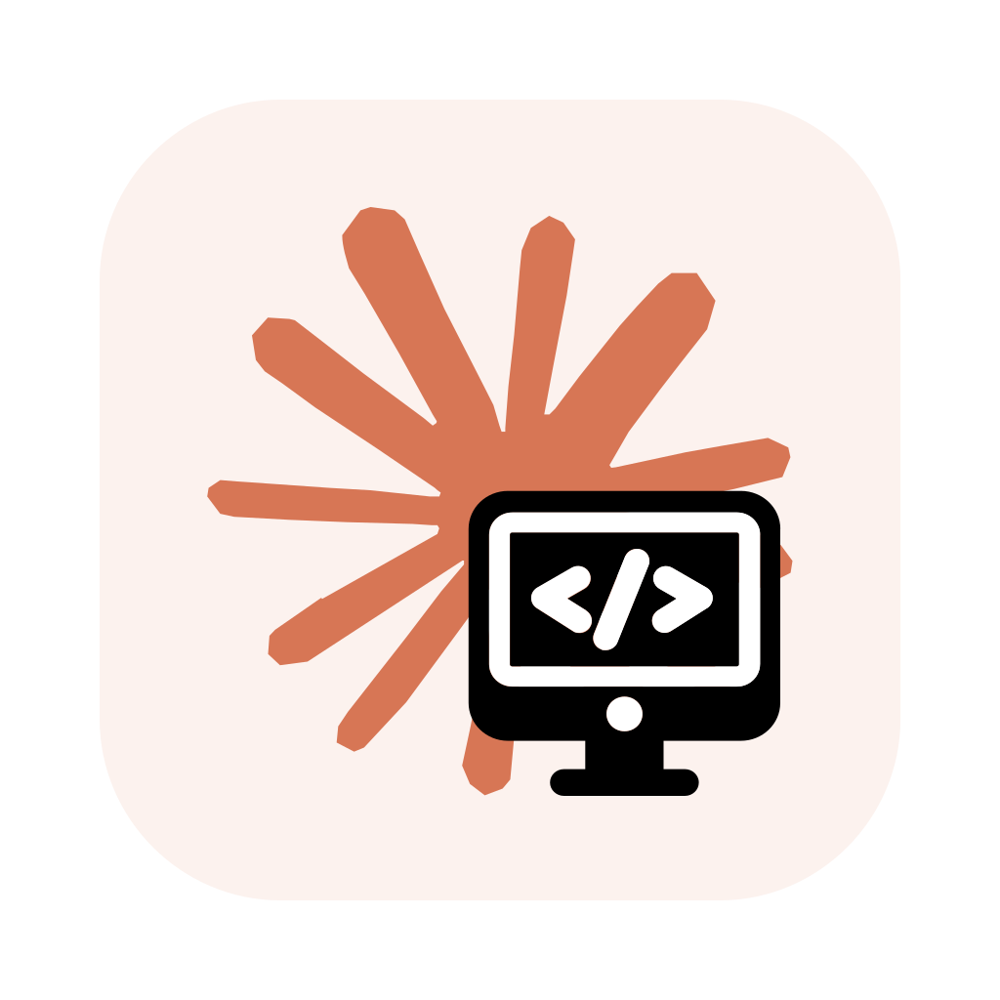

# Claude Code UI Desktop

<!-- PROJECT SHIELDS -->

[![Contributors][contributors-shield]][contributors-url]
[![Forks][forks-shield]][forks-url]
[![Stargazers][stars-shield]][stars-url]
[![Issues][issues-shield]][issues-url]
[![GPL License][license-shield]][license-url]

<p align="center">
<!-- PROJECT LOGO -->
<br />

<p align="center">
  <a href="https://github.com/felix-liuyj/claude-code-ui-desktop">
    
  </a>

<h3 align="center">Claude Code UI Desktop</h3>
<p align="center">
    基于 siteboon/claudecodeui 的桌面版本，为 Claude Code CLI 提供原生 Electron 应用体验
    <br />
    <a href="https://github.com/siteboon/claudecodeui"><strong>查看原项目 »</strong></a>
    <br />
    <br />
    <a href="https://github.com/siteboon/claudecodeui">原版演示</a>
    ·
    <a href="https://github.com/felix-liuyj/claude-code-ui-desktop/issues">报告Bug</a>
    ·
    <a href="https://github.com/felix-liuyj/claude-code-ui-desktop/issues">功能请求</a>
</p>

## 目录

- [Claude Code UI Desktop](#claude-code-ui-desktop)
  - [目录](#目录)
  - [关于项目](#关于项目)
    - [相比 Web 版本的改进](#相比-web-版本的改进)
    - [继承的核心功能](#继承的核心功能)
    - [技术特点](#技术特点)
  - [快速开始](#快速开始)
    - [环境要求](#环境要求)
    - [安装步骤](#安装步骤)
  - [项目结构](#项目结构)
  - [核心功能](#核心功能)
    - [🎯 智能对话系统](#-智能对话系统)
    - [🖥️ 桌面集成](#️-桌面集成)
    - [📁 文件管理](#-文件管理)
    - [🌲 版本控制](#-版本控制)
    - [🔄 会话管理](#-会话管理)
  - [开发指南](#开发指南)
    - [开发命令](#开发命令)
  - [架构设计](#架构设计)
    - [系统概览](#系统概览)
    - [核心架构模式](#核心架构模式)
  - [部署选项](#部署选项)
    - [桌面应用打包](#桌面应用打包)
  - [高级功能](#高级功能)
    - [🎯 智能会话保护系统](#-智能会话保护系统)
    - [🔧 高级 Claude CLI 集成](#-高级-claude-cli-集成)
    - [📊 项目智能管理](#-项目智能管理)
  - [技术栈](#技术栈)
    - [核心框架](#核心框架)
    - [UI 和样式](#ui-和样式)
    - [数据和通信](#数据和通信)
    - [开发工具](#开发工具)
  - [安全配置](#安全配置)
    - [启用工具](#启用工具)
    - [桌面版本安全优势](#桌面版本安全优势)
  - [故障排除](#故障排除)
    - [常见问题与解决方案](#常见问题与解决方案)
      - ["未找到 Claude 项目"](#未找到-claude-项目)
      - [桌面应用启动失败](#桌面应用启动失败)
      - [图像上传问题](#图像上传问题)
      - [MCP 服务器连接问题](#mcp-服务器连接问题)
      - [文件浏览器问题](#文件浏览器问题)
  - [贡献指南](#贡献指南)
    - [开始贡献](#开始贡献)
    - [开发流程](#开发流程)
  - [许可证](#许可证)
  - [致谢](#致谢)
    - [构建基础](#构建基础)
    - [特别感谢](#特别感谢)

## 关于项目

**注意：这是一个纯Electron桌面版本，已移除所有Web相关功能，仅保留桌面端支持。**

Claude Code UI Desktop 是基于 [siteboon/claudecodeui](https://github.com/siteboon/claudecodeui)
开发的桌面版本，为 [Claude Code CLI](https://docs.anthropic.com/en/docs/claude-code) 提供原生的 Electron 桌面应用体验。

本项目为纯桌面版本，已完全移除Web认证系统和在线部署功能，专注于提供最佳的桌面端体验。通过嵌入式服务器架构和直接的本地通信，提供更加安全、快速、稳定的使用体验。

### 相比 Web 版本的改进

- **🖥️ 纯桌面体验** - 移除所有Web组件，专为桌面优化
- **⚡ 简化架构** - 无需认证系统，直接本地通信
- **🔒 更强安全性** - 纯本地运行，无网络安全风险
- **📋 系统集成** - 支持系统托盘、菜单栏、文件关联等原生功能
- **💾 完全离线** - 无需互联网连接即可使用所有功能
- **🚀 性能卓越** - 移除Web开销，响应更快更稳定

### 继承的核心功能

- **💬 交互式聊天界面** - 与 Claude Code 的无缝通信
- **🖱️ 集成终端** - 内置 shell 功能，直接访问 Claude Code CLI
- **📁 文件浏览器** - 交互式文件树，支持语法高亮和实时编辑
- **🌲 Git 集成** - 查看、暂存和提交更改，支持分支切换
- **📱 响应式设计** - 在桌面、平板和移动设备上无缝工作
- **🔄 会话管理** - 恢复对话，管理多个会话，跟踪历史

### 技术特点

- **嵌入式服务器架构** - Express 服务器直接运行在 Electron 主进程中
- **简化的本地通信** - 所有 API 调用都通过本地端口，无需网络认证
- **实时项目同步** - 基于 chokidar 的文件系统监视器，300ms 防抖优化
- **会话保护系统** - 防止 WebSocket 更新中断活动对话，支持临时会话 ID
- **智能项目发现** - 自动解析 JSONL 文件提取项目目录，支持缓存优化
- **图像上传支持** - 完整的图像处理流程，支持多种格式和临时文件管理
- **MCP 服务器集成** - 自动检测 ~/.claude.json 中的 MCP 配置
- **跨平台支持** - 支持 Windows、macOS 和 Linux，原生菜单和快捷键

## 快速开始

### 环境要求

1. **Node.js** v20 或更高版本
2. **Claude Code CLI** - 已安装并配置
3. **Git** - 版本控制
4. **操作系统** - Windows, macOS, 或 Linux

### 安装步骤

1. **克隆仓库**

    ```bash
    git clone https://github.com/felix-liuyj/claude-code-ui-desktop.git
    cd claude-code-ui-desktop
    ```

2. **安装依赖**

    ```bash
    npm install
    ```

3. **运行桌面应用**

    ```bash
    # 开发模式
    npm run electron-dev
    
    # 或者先构建再运行
    npm run build
    npm run electron
    ```

4. **首次使用设置**
    - 桌面应用会自动启动并连接到端口 3001
    - 应用会自动检测并使用已安装的 Claude Code CLI
    - 无需认证配置，直接开始使用
    - 首次运行会自动发现现有 Claude 项目，也可手动添加新项目

## 项目结构

```text
claude-code-ui-desktop/
├── /electron/                # Electron 主进程
│  ├── main.js                # 主进程入口，窗口管理
│  └── preload.js             # 预加载脚本，IPC 桥接
├── /src/                     # React 前端应用
│  ├── /components/           # 可复用组件
│  ├── /contexts/             # React 上下文 (仅主题)
│  ├── /hooks/                # 自定义 Hooks
│  ├── /utils/                # 工具函数
│  └── App.jsx                # 主应用组件
├── /server/                  # Node.js 后端服务 (嵌入式)
│  ├── /routes/               # API 路由 (Git, MCP)
│  ├── claude-cli.js          # Claude CLI 集成
│  ├── projects.js            # 项目管理
│  └── index.js               # 服务器入口
├── /public/                  # 静态资源
│  ├── /icons/                # 应用图标
│  └── /screenshots/          # 项目截图
├── /scripts/                 # 构建脚本
├── /dist/                    # 构建输出 (前端)
├── /dist-electron/           # Electron 打包输出
├── package.json              # 项目配置和依赖
├── vite.config.js            # Vite 构建配置
├── tailwind.config.js        # Tailwind CSS 配置
├── CLAUDE.md                 # Claude Code 指导文档
└── README.md                 # 项目说明文档
```

## 核心功能

### 🎯 智能对话系统
- **💬 交互式聊天界面** - 与 Claude Code 的无缝通信，支持流式响应
- **🖼️ 图像上传支持** - 拖拽上传图片，自动转换为临时文件供 Claude 分析
- **🎛️ 权限模式管理** - 支持默认、自动接受、危险跳过、规划模式四种权限级别
- **📝 工具配置** - 细粒度工具启用/禁用，规划模式自动配置专用工具

### 🖥️ 桌面集成
- **🖱️ 集成终端** - 内置 PTY 终端，直接访问 Claude Code CLI
- **📋 原生菜单** - 中文菜单系统，支持快捷键操作
- **🖥️ 系统托盘** - 真正的桌面应用体验，支持后台运行
- **⌨️ 键盘快捷键** - 完整的快捷键支持，提高操作效率

### 📁 文件管理
- **📁 智能文件浏览器** - 交互式文件树，支持语法高亮和实时编辑
- **🔍 项目自动发现** - 智能解析 Claude 会话记录，自动提取项目路径
- **📂 手动项目添加** - 支持通过文件路径手动添加项目
- **💾 文件备份机制** - 编辑文件时自动创建备份，确保数据安全

### 🌲 版本控制
- **🌲 Git 集成** - 查看、暂存和提交更改，支持分支切换
- **📊 MCP 服务器支持** - 自动检测并配置 Model Context Protocol 服务器
- **🔄 实时同步** - 文件系统监视器实时同步项目变化

### 🔄 会话管理
- **🔄 会话恢复** - 恢复对话，管理多个会话，跟踪历史记录
- **🛡️ 会话保护** - 智能防止自动更新中断活动对话
- **📱 响应式设计** - 适配桌面环境的优化用户界面
- **💾 完全离线** - 无需互联网连接即可使用所有功能
- **🔒 本地安全** - 纯本地运行，无网络安全风险

## 开发指南

### 开发命令

```bash
# 桌面应用开发 (主要开发方式)
npm run electron-dev         # 构建并运行 Electron 开发模式 (推荐)
npm run electron             # 运行 Electron (需要先构建)
npm run electron-pack        # 构建并打包 Electron 应用
npm run dist                 # 创建可分发的安装包

# 构建命令
npm run build                # 构建 React 前端
npm start                    # 启动 Electron 应用 (等同于 electron-dev)

# 依赖管理
npm install                  # 安装所有依赖
```

**开发提示**:
- 使用 `npm run electron-dev` 进行日常开发，会自动处理构建和端口清理
- `scripts/start-electron.js` 会自动检测并杀死占用 3001 端口的进程
- 如果 `dist/` 目录不存在，启动脚本会自动运行构建过程

## 架构设计

### 系统概览

```text
┌─────────────────┐    ┌─────────────────┐    ┌─────────────────┐
│   Frontend      │    │   Backend       │    │  Claude CLI     │
│   (React/Vite)  │◄──►│ (Express/WS)    │◄──►│  Integration    │
│   + Electron    │    │   Embedded      │    │   Process       │
└─────────────────┘    └─────────────────┘    └─────────────────┘
```

### 核心架构模式

1. **嵌入式服务器架构**
    - Express 服务器直接运行在 Electron 主进程中
    - 运行时动态导入：`await import(serverPath)`
    - 固定端口 3001，无需动态端口分配
    - 与 Electron 应用生命周期自动管理

2. **会话保护系统** (`src/App.jsx`)
    - 防止 WebSocket 项目更新清除活动聊天消息
    - 使用 `activeSessions` Set 跟踪进行中的对话
    - 支持真实会话 ID 和临时 "new-session-*" 标识符
    - `isUpdateAdditive()` 函数允许侧边栏更新同时保护活动聊天

3. **简化的本地通信架构**
    - 单一 WebSocket 服务器，基于 URL 的路由 (`/ws` vs `/shell`)
    - `/ws` 端点：聊天消息、项目更新、会话管理
    - `/shell` 端点：直接 Claude CLI 终端访问，使用 PTY
    - 通过 chokidar 文件系统监视器实现实时项目同步
    - 移除所有认证层，直接本地通信

## 部署选项

### 桌面应用打包

```bash
# 为当前平台创建可分发包
npm run dist

# 输出位置
./dist-electron/
├── win-unpacked/     # Windows 解压版本
├── ClaudeCodeUI.exe  # Windows 安装程序
├── ClaudeCodeUI.dmg  # macOS 磁盘镜像
└── ClaudeCodeUI.AppImage  # Linux AppImage
```

**注意**: 本桌面版本专注于本地应用体验，已移除 Docker 部署和 Web 服务器部署选项。

## 高级功能

### 🎯 智能会话保护系统

应用实现了复杂的会话保护机制，确保最佳用户体验：

- **活动会话追踪**: 使用 `activeSessions` Set 追踪正在进行的对话
- **临时会话支持**: 支持 "new-session-*" 临时标识符，无缝过渡到真实会话 ID
- **增量更新过滤**: `isUpdateAdditive()` 函数区分安全的侧边栏更新和破坏性内容更改
- **自动恢复**: 会话完成或中止后自动恢复项目更新功能

### 🔧 高级 Claude CLI 集成

- **权限模式智能管理**: 
  - 默认模式：标准 Claude Code 操作
  - 自动接受模式：自动接受文件修改
  - 危险跳过模式：跳过所有权限检查（橙色警告）
  - 规划模式：自动配置专用工具集 (Read, Task, exit_plan_mode, TodoRead, TodoWrite)

- **MCP 服务器自动发现**:
  - 智能扫描 `~/.claude.json` 配置文件
  - 支持全局和项目特定的 MCP 服务器
  - 仅在检测到有效配置时传递 `--mcp-config` 参数

- **图像处理流程**:
  - 支持拖拽上传多种格式图像
  - 自动转换为临时文件，存储在项目的 `.tmp/images/` 目录
  - Base64 数据处理和文件路径注入 Claude 提示
  - 会话结束后自动清理临时文件

### 📊 项目智能管理

- **JSONL 会话分析**: 解析 Claude 会话文件提取真实项目路径
- **智能目录缓存**: 内存缓存系统提高项目发现性能
- **多策略路径选择**: 优先使用最近使用或最频繁的工作目录
- **包名自动检测**: 从 `package.json` 自动生成友好的显示名称

## 技术栈

### 核心框架

- **[Electron](https://www.electronjs.org/)** - 跨平台桌面应用框架
- **[React 18](https://react.dev/)** - 用户界面库
- **[Vite](https://vitejs.dev/)** - 快速构建工具和开发服务器
- **[Express.js](https://expressjs.com/)** - Node.js Web 框架
- **[Node.js](https://nodejs.org/)** - JavaScript 运行时

### UI 和样式

- **[Tailwind CSS](https://tailwindcss.com/)** - 实用优先的 CSS 框架
- **[CodeMirror](https://codemirror.net/)** - 高级代码编辑器
- **[Lucide React](https://lucide.dev/)** - 图标库
- **[React Router](https://reactrouter.com/)** - 前端路由

### 数据和通信

- **[WebSocket (ws)](https://github.com/websockets/ws)** - 实时通信，双路由架构 (`/ws`, `/shell`)
- **[Chokidar](https://github.com/paulmillr/chokidar)** - 文件系统监视，300ms 防抖优化
- **[Multer](https://github.com/expressjs/multer)** - 多部分文件上传处理

### 开发工具

- **[node-pty](https://github.com/microsoft/node-pty)** - 伪终端集成，支持真彩色
- **[cross-spawn](https://github.com/moxystudio/node-cross-spawn)** - 跨平台进程spawning
- **[Electron Builder](https://www.electron.build/)** - Electron 打包工具，支持所有主流平台

## 安全配置

**重要提醒**: 所有 Claude Code 工具默认处于 **禁用状态**，防止潜在有害操作自动运行。

### 启用工具

要使用 Claude Code 的完整功能，需要手动启用工具：

1. **打开设置** - 点击侧边栏的齿轮图标
2. **选择性启用** - 仅开启需要的工具
3. **应用设置** - 偏好设置会本地保存

**推荐方法**: 从基本工具开始，根据需要逐步添加更多工具。

### 桌面版本安全优势

- **无网络风险** - 纯本地运行，无需担心网络安全问题
- **无认证泄露** - 移除了所有认证系统，避免凭据泄露风险
- **本地数据** - 所有数据存储在本地，完全可控

## 故障排除

### 常见问题与解决方案

#### "未找到 Claude 项目"

**问题**: UI 显示无项目或空项目列表
**解决方案**:

- 确保 [Claude Code CLI](https://docs.anthropic.com/en/docs/claude-code) 已正确安装
- 在至少一个项目目录中运行 `claude` 命令进行初始化
- 验证 `~/.claude/projects/` 目录存在且有正确权限
- 使用"添加项目"功能手动添加现有项目目录

#### 桌面应用启动失败

**问题**: Electron 应用无法启动或崩溃
**解决方案**:

- 检查 Node.js 版本是否为 v20+
- 删除 `node_modules` 并重新安装依赖：`rm -rf node_modules && npm install`
- 查看控制台错误信息，特别注意端口占用情况
- 手动清理端口：`lsof -ti:3001 | xargs kill -9`
- 确保有足够的磁盘空间用于临时文件

#### 图像上传问题

**问题**: 图像无法上传或处理失败
**解决方案**:

- 检查图像格式是否支持 (JPEG, PNG, GIF, WebP, SVG)
- 确保图像文件大小不超过 5MB
- 验证项目目录有写入权限，用于创建临时文件
- 检查 `.tmp/images/` 目录是否可以正常创建

#### MCP 服务器连接问题

**问题**: MCP 服务器无法连接或未被检测
**解决方案**:

- 检查 `~/.claude.json` 文件是否存在和格式正确
- 验证 MCP 服务器配置是否有效
- 查看控制台日志中的 MCP 相关错误信息
- 尝试重启应用以重新检测 MCP 配置

#### 文件浏览器问题

**问题**: 文件无法加载，权限错误，空目录
**解决方案**:

- 检查项目目录权限 (`ls -la` 在终端中)
- 验证项目路径存在且可访问
- 查看服务器控制台日志获取详细错误信息
- 尝试刷新项目列表或重新添加项目

## 贡献指南

我们欢迎贡献！请遵循以下指导原则：

### 开始贡献

1. **Fork** 仓库
2. **克隆** 你的 fork: `git clone <your-fork-url>`
3. **安装** 依赖: `npm install`
4. **创建** 功能分支: `git checkout -b feature/amazing-feature`

### 开发流程

1. **进行更改** - 遵循现有代码风格
2. **彻底测试** - 确保所有功能正常工作
3. **提交** - 使用描述性消息，遵循 [Conventional Commits](https://conventionalcommits.org/)
4. **推送** - 到你的分支: `git push origin feature/amazing-feature`
5. **提交** Pull Request，包含:
    - 清晰的更改描述
    - UI 更改的截图
    - 测试结果（如适用）

## 许可证

GNU General Public License v3.0 - 查看 [LICENSE](LICENSE) 文件了解详情。

本项目是开源的，可在 GPL v3 许可证下自由使用、修改和分发。

## 致谢

### 构建基础

- **[Claude Code](https://docs.anthropic.com/en/docs/claude-code)** - Anthropic 官方 CLI
- **[React](https://react.dev/)** - 用户界面库
- **[Electron](https://www.electronjs.org/)** - 跨平台桌面应用框架
- **[Vite](https://vitejs.dev/)** - 快速构建工具
- **[Tailwind CSS](https://tailwindcss.com/)** - 实用优先的 CSS 框架

### 特别感谢

- **[siteboon/claudecodeui](https://github.com/siteboon/claudecodeui)** - 原始 Web 版本项目，本桌面版本基于此开发
- **[Siteboon](https://claudecodeui.siteboon.ai/)** - 原项目的创建者和维护者
- Claude Code 团队提供优秀的 CLI 工具
- 开源社区的所有贡献者
- 所有用户的反馈和建议

---

为 Claude Code 社区精心制作

<!-- links -->

[contributors-shield]: https://img.shields.io/github/contributors/felix-liuyj/claude-code-ui-desktop.svg?style=flat-square

[contributors-url]: https://github.com/felix-liuyj/claude-code-ui-desktop/graphs/contributors

[forks-shield]: https://img.shields.io/github/forks/felix-liuyj/claude-code-ui-desktop.svg?style=flat-square

[forks-url]: https://github.com/felix-liuyj/claude-code-ui-desktop/network/members

[stars-shield]: https://img.shields.io/github/stars/felix-liuyj/claude-code-ui-desktop.svg?style=flat-square

[stars-url]: https://github.com/felix-liuyj/claude-code-ui-desktop/stargazers

[issues-shield]: https://img.shields.io/github/issues/felix-liuyj/claude-code-ui-desktop.svg?style=flat-square

[issues-url]: https://github.com/felix-liuyj/claude-code-ui-desktop/issues

[license-shield]: https://img.shields.io/github/license/felix-liuyj/claude-code-ui-desktop.svg?style=flat-square

[license-url]: https://github.com/felix-liuyj/claude-code-ui-desktop/blob/master/LICENSE